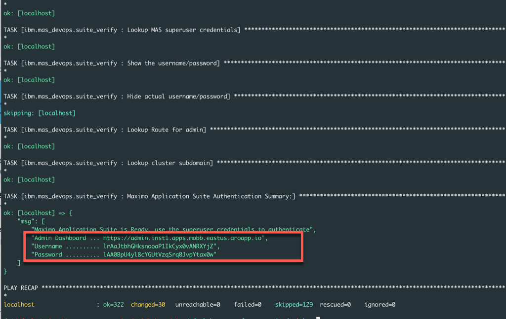

IBM Maximo Application Suite (MAS) is a set of applications for asset monitoring, management, predictive maintenance and reliability planning.  When combined with Red Hat OpenShift Dedicated on Google Cloud ( OSD GCP ), this frees up your Maximo and operations team to focus on what is important to them ( Maximo ) rather than having to worry about managing and building clusters.

This document outlines how to get quickly get started with OSD GCP and installing Maximo all through automation.


## Prerequisites
* a OSD GCP Cluster (see [Deploying OSD GCP](/experts/gcp/osd_preexisting_vpc/))
> Note: Please check the latest Maximo support matrix, at the time of this writing, OpenShift 4.14 is latest OpenShift version supported by Maximo.

* oc cli
* gcloud cli
* ansible cli
* ocm cli
* a Maximo License Key
<br>

> Note: You must log into your OSD GCP cluster via your oc cli and into the RedHat OpenShift Cloud Manager ( ocm ) CLI before going through the following steps.

## Prepare the Environment

<b>Maximo environment variables.</b>
    
You do need both an IBM entitlement key and a Maximo license ID and file.  These can be obtained from IBM.</b>

```bash
export IBM_ENTITLEMENT_KEY=XYZ
export MAS_CONFIG_DIR=~/tmp/masconfig
export DRO_CONTACT_EMAIL=name@company.com
export DRO_CONTACT_FIRSTNAME=First
export DRO_CONTACT_LASTNAME=Last
export MAS_INSTANCE_ID=inst1
export SLS_LICENSE_ID=
export SLS_LICENSE_FILE=
export PROMETHEUS_ALERTMGR_STORAGE_CLASS=standard-csi
export PROMETHEUS_STORAGE_CLASS=standard-csi
export PROMETHEUS_USERWORKLOAD_STORAGE_CLASS=filestore-csi
export GRAFANA_INSTANCE_STORAGE_CLASS=filestore-csi
export MONGODB_STORAGE_CLASS=standard-csi
export UDS_STORAGE_CLASS=filestore-csi
export DRO_STORAGE_CLASS=filestore-csi
mkdir -p $MAS_CONFIG_DIR
```

<br>

<b>GCP / OpenShift Environment Variables </b>

Use the following defaults or adjust accordingly


```bash
export CLUSTER_NAME=<name of OSD GCP cluster>
export ZONE_FS=$(ocm describe cluster $CLUSTER_NAME --json | jq -r '.nodes.availability_zones[0]')
export NAME_FS="nfs-server"
export TIER_FS="BASIC_HDD"
export VOL_NAME_FS="osd4"
export CAPACITY="1TB"
export VPC_NETWORK=$(oc -n openshift-machine-api get machinesets -o json | jq -r '.items[0].spec.template.spec.providerSpec.value.networkInterfaces[0].network')
```
<br>

  
## Prepare the Storage Accounts for MAS
The first step is to add Filestore Storage to the cluster to provide ReadWriteMany access for Maximo.


1. Install the GCP Filestore CSI Driver Operator

   ```bash
   cat <<EOF | oc create -f -
   apiVersion: operators.coreos.com/v1
   kind: OperatorGroup
   metadata:
     generateName: openshift-cluster-csi-drivers-
     namespace: openshift-cluster-csi-drivers
   ---
   apiVersion: operators.coreos.com/v1alpha1
   kind: Subscription
   metadata:
     labels:
       operators.coreos.com/gcp-filestore-csi-driver-operator.openshift-cluster-csi-drivers: ""
     name: gcp-filestore-csi-driver-operator
     namespace: openshift-cluster-csi-drivers
   spec:
     channel: stable
     installPlanApproval: Automatic
     name: gcp-filestore-csi-driver-operator
     source: redhat-operators
     sourceNamespace: openshift-marketplace
   EOF
   ```

1. Create the GCP Filestore storage class

   ```bash
   cat <<EOF | oc create -f -
   kind: StorageClass
   apiVersion: storage.k8s.io/v1
   metadata:
     name: filestore-csi
   provisioner: filestore.csi.storage.gke.io
   parameters:
     connect-mode: DIRECT_PEERING 
     network: $VPC_NETWORK
   allowVolumeExpansion: true
   volumeBindingMode: WaitForFirstConsumer
   EOF
   ```

1. Create a Filestore instance fo the Cluster CSI Driver

   ```bash
   cat <<EOF | oc create -f -
   apiVersion: operator.openshift.io/v1
   kind: ClusterCSIDriver
   metadata:
     name: filestore.csi.storage.gke.io
   spec:
     managementState: Managed
   EOF
   ```

## Install IBM Maximo Application Suite with Ansible

IBM has provided an ansible playbook to automate the installation of Maximo and all the required dependencies making it very easy and repeatable to get started with Maximo.

Click [here](https://ibm-mas.github.io/ansible-devops/playbooks/oneclick-core) to learn more about the OneClick Install of Maximo.

1. Install the Maximo Ansible collection

```bash
ansible-galaxy collection install ibm.mas_devops
```

1. Run the Ansible playbook
```bash
ansible-playbook ibm.mas_devops.oneclick_core
```

And that's it!! ... it will take about 90 minutes for the installation to complete follow along the ansible log messages if you like.

You can also open the OpenShift web console and view the projects and resources the playbook is creating.


When the playbook finishes, you will see the following showing the installation is complete along with the MAS Admin Dashboard with username and password to use.



Open the MAS Dashboard URL in your browser and log in with the given username and password.


> Note: If you are using the default aroapp.io domain that comes with ARO, the URL will show it's insecure due to an untrusted CA.
For a production level Maximo installation with ARO, the cluster should be created with a [custom domain](https://cloud.redhat.com/experts/aro/cert-manager/) where you control the certificates.  Follow these [directions](https://www.ibm.com/docs/en/mas-cd/continuous-delivery?topic=management-manual-certificate) from IBM in manually appling the certificates for MAS.

If you see a blue spinning circle from the admin page like this:


In the browswer, change admin to api and hit enter.
For example: change https://admin.inst1.apps.mobb.eastus.openshiftapps.com/ to
https://api.inst1.apps.mobb.eastus.openshiftapps.com/

This will return a message like the following:


Try to load the admin screen and this time it should work.

## Install Maximo Applications ( Optional )

Optionally install Maximo applications you would like to use.  In this example, we will install IT and Asset Configuration Manager.

On the Admin page, click on Catalog and then under applications click on Manage.


Select both IT and Asset Configuration Manager and then clikc on Continue.


Keep the defaults and click on Subscribe to channel.  Note that this can take 10+ minutes.


Once you see thate Manage is ready to be activated, click on Activate


Finally, click on Start activation on the next screen.  Note that this step can take several hours.


