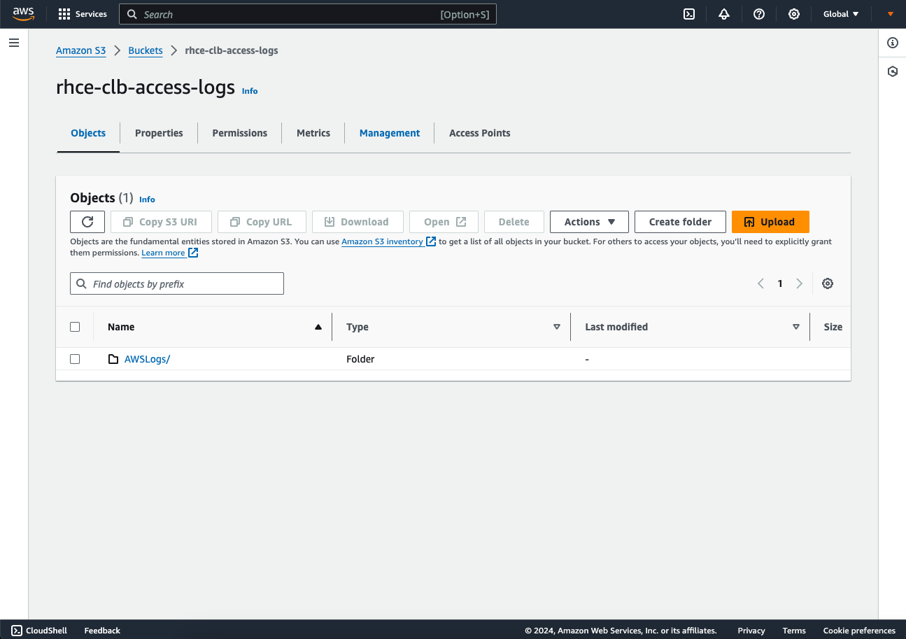

This guide will show you how to enable access logging on the default Classic Load Balancer ingress controller used in Red Hat OpenShift Service on AWS (ROSA) version 4.13 and earlier.

## Prerequisites

* A ROSA Cluster (Version 4.13 or earlier)
* A logged in `oc` CLI
* A logged in `aws` CLI

### S3 Bucket Creation

1. Run the following command, making sure to update the name of the S3 bucket you wish to create and the account number of the Elastic Load Balancing root account (this is not your AWS account):

    ```bash
    export CLB_AL_BUCKET=rhce-clb-access-logs
    export ELB_ACCOUNT=127311923021
    ```

    While my example uses the `us-east-1` root account, ensure you select the proper account number for the region from the [AWS documentation](https://docs.aws.amazon.com/elasticloadbalancing/latest/classic/enable-access-logs.html#attach-bucket-policy).


1. Create your S3 bucket for your access logs to be stored. For this example, we will call our bucket rosa-clb-access-logs

    ```bash
    aws s3 mb s3://${CLB_AL_BUCKET}
    ```

1. Create and apply the following AWS S3 Bucket Policy to ensure that the Elastic Load Balancing account can log to designated S3 bucket:

    ```bash
    cat << EOF > bucket-policy.json
    {
        "Version": "2012-10-17",
        "Statement": [
            {
                "Effect": "Allow",
                "Principal": {
                    "AWS": "arn:aws:iam::${ELB_ACCOUNT}:root"
                },
                "Action": "s3:PutObject",
                "Resource": "arn:aws:s3:::${CLB_AL_BUCKET}/AWSLogs/$(aws sts get-caller-identity --query Account --output text)/*"
            }
        ]
    }
    EOF
    aws s3api put-bucket-policy --bucket ${CLB_AL_BUCKET} --policy file://bucket-policy.json
    ```

1. Run the following command to annotate the default ingress controller with the necessary annotations to enable Elastic Load Balancing access logging:

    ```bash
    oc -n openshift-ingress annotate service/router-default \
    service.beta.kubernetes.io/aws-load-balancer-access-log-s3-bucket-name=${CLB_AL_BUCKET} \
    service.beta.kubernetes.io/aws-load-balancer-access-log-emit-interval='5' \
    service.beta.kubernetes.io/aws-load-balancer-access-log-enabled='true'
    ```

Congratulations! You have now enabled access logging on your Classic Load Balancer. Your logs will begin to flow into the bucket that you have created, as shown below:

