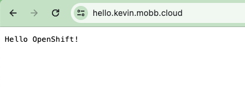

Starting with OpenShift 4.14, ROSA supports adding additional Ingress Controllers which can use used to configure a custom domain on a ROSA cluster without having to use the now deprecated Custom Domain Operator.  This guide shows how to add an additional Ingress Controller ( public or private ) to a ROSA cluster and optionally also configuring a custom domain.

## Prerequisites

* A Red Hat OpenShift on AWS (ROSA) cluster
* The oc CLI      #logged in.
* The aws CLI     #logged in.
* The rosa CLI    #logged in.
* (optional) A Public Route53 Hosted Zone, and the related Domain to use.


## Set up environment


1. Export few environment variables
> **Important**: The variables below can be customized to fit your needs for your ingress controller.

```bash
export DOMAIN=lab.domain.com   #Custom Hosted Zone Domain for apps 
export DOMAIN_DASH=$(echo $DOMAIN | tr . -)
export EMAIL=you@domain.com   #Optional - your email address if you are generating your own certificate
```

> **CERT_NAME** - this is the name of the tls secret for the domain of your ingress controller.  This tls secret must be stored in the `openshift-ingress` namespace. If you are adding an additional Ingress Controller to the openshiftapps.com domain that comes with ROSA, use the name of the secret in the openshift-ingress namespace that has the naming format of `(ID)-primary-cert-bundle-secret`.

>Optional: To create your own certificate, you can use certbot to create one.

```bash
certbot certonly --manual \
  --preferred-challenges=dns \
  --email $EMAIL \
  --server https://acme-v02.api.letsencrypt.org/directory \
  --agree-tos \
  --config-dir "./config" \
  --work-dir "./work" \
  --logs-dir "./logs" \
  -d "*.$DOMAIN"
  ```

The output of this command will show where your certificates are located.

```bash
Successfully received certificate.
Certificate is saved at: /Users/kevincollins/tmp/masconfig/config/live/kevin.mobb.cloud/fullchain.pem
Key is saved at:         /Users/kevincollins/tmp/masconfig/config/live/kevin.mobb.cloud/privkey.pem
```

Taking the values from the above command, create a certificate.
```bash
oc create secret tls ${DOMAIN_DASH}-tls-cert --key=/Users/kevincollins/tmp/masconfig/config/live/kevin.mobb.cloud/privkey.pem --cert=/Users/kevincollins/tmp/masconfig/config/live/kevin.mobb.cloud/fullchain.pem -n openshift-ingress
``` 

> **SCOPE** - this will be the scope of the Network Load Balancer that will be provisioned.  The scope can be either **Internal** for a private network load balancer or **External** for an Internet facing network load balancer.


   ```bash
   export INGRESS_NAME=public-ingress #name of the new ingress controller
   export CERT_NAME=${DOMAIN_DASH}-tls-cert
   export SCOPE="External" 
   export AWS_PAGER=""
   export HOSTED_ZONE_ID=ABCDEFGHEXAMPLE
   export HOSTED_ZONE_REGION=us-east-2
   export SCRATCH_DIR=/tmp/scratch
   mkdir -p $SCRATCH_DIR
   ```

## Create the Ingress Controller.

   ```yaml
   envsubst  <<EOF | oc apply -f -
   apiVersion: operator.openshift.io/v1
   kind: IngressController
   metadata:
     annotations:
       ingress.operator.openshift.io/auto-delete-load-balancer: "true"
     finalizers:
     - ingresscontroller.operator.openshift.io/finalizer-ingresscontroller
     generation: 2
     labels:
       hypershift.openshift.io/managed: "true"
     name: $INGRESS_NAME
     namespace: openshift-ingress-operator
   spec:
     clientTLS:
       clientCA:
         name: ""
       clientCertificatePolicy: ""
     defaultCertificate:
       name: $CERT_NAME
     domain: $DOMAIN
     endpointPublishingStrategy:
       loadBalancer:
         dnsManagementPolicy: Unmanaged
         providerParameters:
           aws:
             networkLoadBalancer: {}
             type: NLB
           type: AWS
         scope: $SCOPE
       type: LoadBalancerService
     httpCompression: {}
     httpEmptyRequestsPolicy: Respond
     httpErrorCodePages:
       name: ""
     replicas: 2
     tuningOptions:
       reloadInterval: 0s
     unsupportedConfigOverrides: null
   EOF
   ```

  Describe the Ingress Controller to confirm it's ready.

   ```bash
   oc describe IngressController $INGRESS_NAME -n openshift-ingress-operator
   ```

   You should see an output that mentions that the ingress controller is Admitted.  

   ```
   Normal   Admitted           2m16s  ingress_controller  ingresscontroller passed validation
   ```

   Also verify the router pods of the new ingress controller are running

   ```bash
   oc get pods -n openshift-ingress | grep $INGRESS_NAME
   ```

  Expected output is two pods in a Running state.
  ```bash
  router-public-7dd48fdcbb-bpdzc    1/1     Running   0          4m20s
router-public-7dd48fdcbb-cn7hb    1/1     Running   0          4m20s
  ```

### Create a Route 53 entry for the new domain / network load balancer

Get the NLB environment variables:
   ```bash
   NLB_HOSTNAME=$(oc get service -n openshift-ingress router-${INGRESS_NAME} -o jsonpath='{.status.loadBalancer.ingress[0].hostname}')
   NLB_NAME=$(echo $NLB_HOSTNAME | sed 's/-.*//')
   NLB_REGION=$(echo $NLB_HOSTNAME | cut -d "." -f 3)
   NLB_HOSTED_ZONE=$(aws elbv2 describe-load-balancers --name $NLB_NAME --region $NLB_REGION | jq -r ".LoadBalancers[0].CanonicalHostedZoneId")

   echo "NLB_HOSTNAME="${NLB_HOSTNAME}
   echo "NLB_NAME="${NLB_NAME}
   echo "NLB_REGION="${NLB_REGION}
   echo "NLB_HOSTED_ZONE="${NLB_HOSTED_ZONE}
   ```
 
  Create an alias record json statement.
   ```bash
   cat <<EOF > $SCRATCH_DIR/add_alias_record.json
   {
	   "Comment":"Adding an alias record for the NLB in Route 53",
	   "Changes":[{
        "Action": "CREATE",
        "ResourceRecordSet":{
		      "Name": "*.$DOMAIN",
			    "Type":"A",
          "AliasTarget": {
            "HostedZoneId": "$NLB_HOSTED_ZONE",
            "DNSName": "$NLB_HOSTNAME",
           "EvaluateTargetHealth": false
			    }
        }
     }
    ]
   }
   EOF
   ```

  Create a new route 53 record to point to the domain / network load balancer
   ```bash
   aws route53 change-resource-record-sets --hosted-zone-id $HOSTED_ZONE_ID --change-batch file://$SCRATCH_DIR/add_alias_record.json
   ```
  

## Test an application.

1. Create a test applciation in a new namespace.

   ```bash
   oc new-project testapp
   oc new-app --docker-image=docker.io/openshift/hello-openshift -n testapp
   ```

2. Expose the test application Service.

   Let's create a Route to expose the application from outside the cluster, and annotate the Route to give it a new Certificate.

   ```bash
   oc create route edge --service=hello-openshift testroute --hostname hello.$DOMAIN -n testapp
   ```


3. Access the application Route.

   Open your browser to hello.$DOMAIN and you will see a secured web page that displays Hello OpenShift.

  


